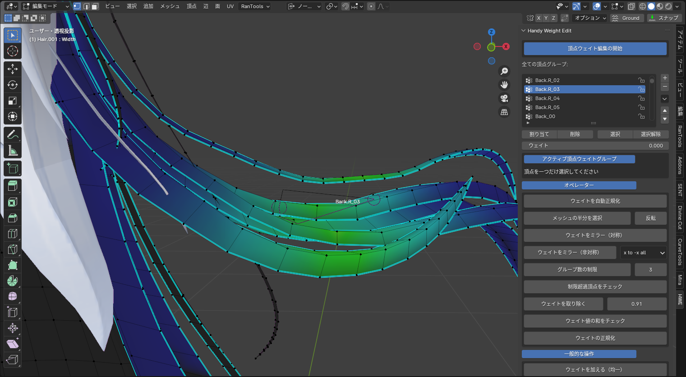
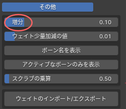

# HandyWeightEdit_UserTranslate-ja
User Translate用 Handy Weight Editの日本語化csv

## これは何
忘却野氏製作のアドオン [User Translate](https://bookyakuno.gumroad.com/l/user-translate) 向けに制作した、young氏製作のアドオン [Handy Weight Edit](https://blendermarket.com/products/handy-weight-edit) の日本語化csvです。
導入方法は [忘却野氏のUser Translateの記事](https://bookyakuno.com/user-translate/) を参考にしてください。

Handy Weight Edit 1.4.1に対応しています。

## 注意点
- UI部分のみの翻訳です。コンソール等は翻訳されていません
- 一部意訳した部分があります
- 一部項目ではBlenderのデフォルトの翻訳辞書が優先されます

